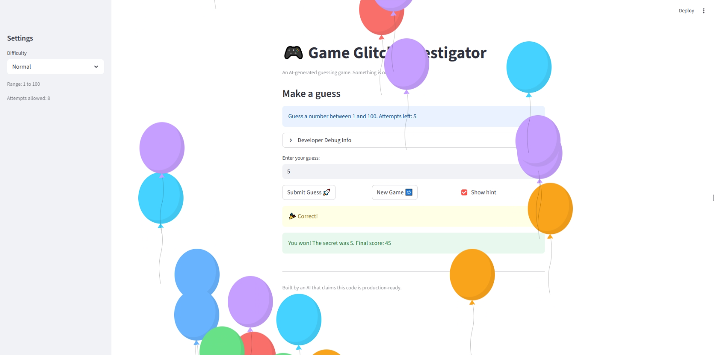

# 🎮 Game Glitch Investigator: The Impossible Guesser

## 🚨 The Situation

You asked an AI to build a simple "Number Guessing Game" using Streamlit.
It wrote the code, ran away, and now the game is unplayable.

- You can't win.
- The hints lie to you.
- The secret number seems to have commitment issues.

## 🛠️ Setup

1. Install dependencies: `pip install -r requirements.txt`
2. Run the broken app: `python -m streamlit run app.py`

## 🕵️‍♂️ Your Mission

1. **Play the game.** Open the "Developer Debug Info" tab in the app to see the secret number. Try to win.
2. **Find the State Bug.** Why does the secret number change every time you click "Submit"? Ask ChatGPT: _"How do I keep a variable from resetting in Streamlit when I click a button?"_
3. **Fix the Logic.** The hints ("Higher/Lower") are wrong. Fix them.
4. **Refactor & Test.** - Move the logic into `logic_utils.py`.
   - Run `pytest` in your terminal.
   - Keep fixing until all tests pass!

## 📝 Document Your Experience

### Game Purpose:

This is a number guessing game where the player tries to guess a secret number within a limited number of attempts. The player selects a difficulty (Easy, Normal, or Hard), each of which sets a different number range and attempt limit. After each guess, the game provides a hint to guide the player higher or lower, and awards points based on how quickly they find the correct number.

### Bugs Found:

1. **Inverted hints** — The `check_guess` function returned "Go HIGHER" when the guess was too high and "Go LOWER" when the guess was too low. The comparison logic was backwards, making it impossible to win by following the hints.

2. **Guess bounds not enforced by difficulty** — The `parse_guess` function did not accept a `difficulty` parameter, so it could not validate whether a guess fell within the correct range for the selected difficulty level.

3. **New game did not reset status** — Clicking "New Game" did not reset `st.session_state.status` back to `"playing"`, so after winning or losing, the game remained locked on the terminal screen and could not be replayed.

### Fixes Applied:

1. Swapped the "Go HIGHER" and "Go LOWER" return values in `check_guess` so hints correctly reflect whether the guess is above or below the secret.

2. Added `difficulty` as a parameter to `parse_guess` and used `get_range_for_difficulty(difficulty)` to validate that each guess falls within the correct bounds for the selected difficulty.

3. Added `st.session_state.status = "playing"` to the "New Game" button handler so the game properly resets and allows replay after a win or loss.

## 📸 Demo

